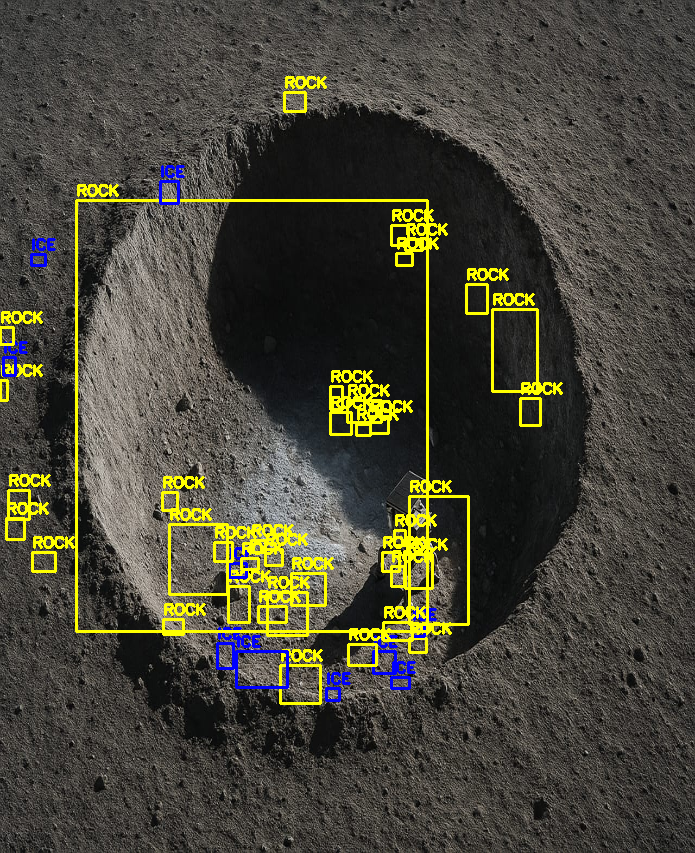

````markdown
# LunaLUX – Rock vs Ice Detection (Prototype)

This project is a **prototype simulation** for Smart India Hackathon.  
It demonstrates how computer vision can differentiate **ice** and **rocks** in lunar craters using simple before/after images — **without using actual sensors**.

---

## 🚀 Project Purpose

Lunar craters in **Permanently Shadowed Regions (PSR)** are very dark. Detecting ice there is crucial for future space missions.  

Since real missions use expensive sensors (spectrometers, radar), this project builds a **low-cost prototype** that:  

1. Takes a **dark crater image (before illumination)**  
2. Takes a **lit crater image (after illumination)**  
3. Uses **Python + OpenCV** to:  
   - Highlight changes between before/after images  
   - Classify bright smooth areas as **Ice**  
   - Classify irregular medium-bright areas as **Rocks**  
4. Shows results with bounding boxes and labels (ICE = blue, ROCK = yellow).  

---

## 🛠️ Installation

### 1. Clone the repository
```bash
git clone https://github.com/<your-username>/<your-repo>.git
cd <your-repo>
````

### 2. Create a virtual environment

This keeps dependencies clean.

**Windows (PowerShell):**

```powershell
python -m venv venv
.\venv\Scripts\Activate
```

**macOS / Linux:**

```bash
python3 -m venv venv
source venv/bin/activate
```

### 3. Install dependencies

With the virtual environment active, run:

```bash
python -m pip install --upgrade pip
pip install opencv-python numpy matplotlib
```

---

## ▶️ How to Run

1. Place your crater images in the project folder:

   * `crater_before.jpg` → dark crater image
   * `crater_after.jpg` → illuminated crater image

2. Run the program:

```bash
python lunalux_detection_demo.py
```

3. The program will:

   * Show 3 panels: **Before | After | Detected (rocks & ice)**
   * Save the annotated result as:

     ```
     crater_detected.png
     ```

---

## 📊 Example Output

* **Before (dark):** crater interior is invisible
* **After (illuminated):** crater floor is visible
* **Detected:** Ice marked in **blue**, Rocks marked in **yellow**



---

## ⚠️ Notes

* Keep your images named exactly:

  ```
  crater_before.jpg
  crater_after.jpg
  ```
* Each time you reopen VS Code or a new terminal, re-activate the virtual environment:

  * Windows: `.\venv\Scripts\Activate`
  * Mac/Linux: `source venv/bin/activate`
* No actual sensors are used — this is a **simulation for prototype demonstration**.

---

## ✨ Future Improvements

* Integrate **TensorFlow Lite** for machine learning classification
* Use real spectral/lunar datasets for training
* Combine with micro-radar for subsurface mapping

---

## 👩‍💻 Authors

Project created for **Smart India Hackathon** demonstration by our team.
1.Jinkala Mounika
2.Katta Shahini
3.Podile Pravallika
4.Takkellapati Pooja
5.Velpuru Ravichandrika
6.Velpuru Nihitha

```

---
